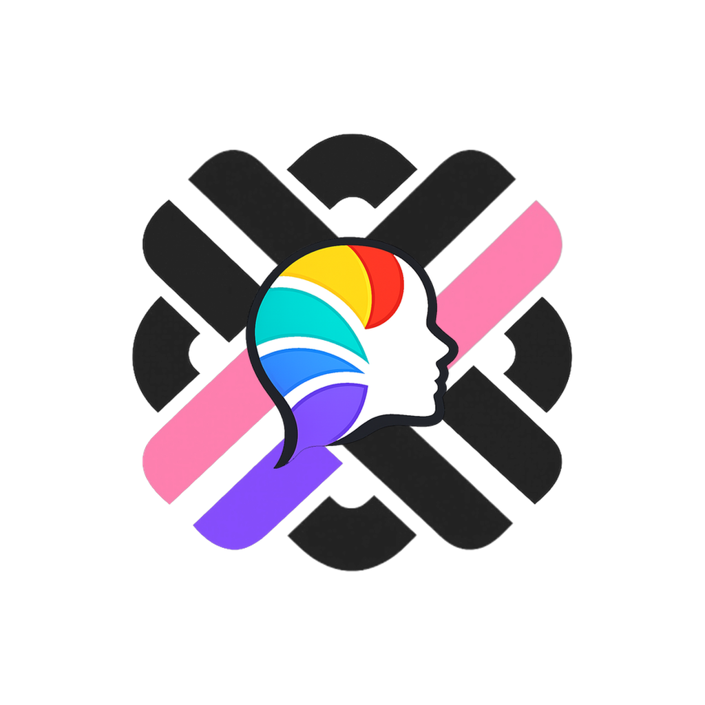

  

# FiveWeave

**Personality can be understood more deeply than simple type labels suggest. Built on the BIG5 model, FiveWeave helps people understand themselves and one another through a more grounded and nuanced view of personality.**

## Why FiveWeave

Personality is often reduced to short labels and simplified categories. While those formats are easy to remember and share, they rarely capture the full texture of how people actually think, feel, relate, and respond.

FiveWeave starts from a different assumption: personality is richer than a fixed type. A better personality experience should not only be easy to approach, but also deep enough to return to, reflect on, and use in everyday life.

FiveWeave is designed for people who want more than a quick label. It aims to support both self-understanding and mutual understanding through a clearer, more structured view of personality.

## Built on the BIG5 model

FiveWeave is built on the BIG5 model of personality, a widely studied framework in personality psychology.

Rather than reducing people to a single fixed type, FiveWeave treats personality as a set of continuous patterns. It looks across the five major dimensions of personality and uses more detailed facet-level interpretation to surface nuances that simpler systems often miss.

The goal is not to assign an identity, but to provide a more trustworthy and expressive way to understand personality.

## What FiveWeave offers

### Measure beyond simple type labels

FiveWeave approaches personality as a structured profile rather than a fixed category. It is designed to reveal patterns that feel more specific, more readable, and more personally meaningful.

### Rich and trustworthy interpretation

FiveWeave does not stop at scores. It aims to provide rich, trustworthy interpretations that help users understand the strengths, trade-offs, and tendencies reflected in each part of their profile.

### Structured visual profiles

Personality results should not feel dense or clinical. FiveWeave presents results through visual profiles that are designed to feel clear, elegant, and intuitive at a glance.

### Concise summaries and identity cues

To make results easier to remember and share, FiveWeave can summarize patterns through compact identity cues, including a five-letter code, expressive subtitles, and short profile summaries. These are designed to support understanding, not replace it.

### Shareable profiles for mutual understanding

FiveWeave is not only about understanding yourself. It also aims to help people understand one another better through shareable personality profiles, mutual visibility, and intuitive comparisons that make differences easier to read without reducing people to stereotypes.

## Designed for understanding people

FiveWeave is designed to be useful both alone and with others.

On your own, it should feel like a profile you want to return to — something you can read slowly, revisit over time, and use to reflect on your own tendencies with more clarity.

With other people, it should open a more thoughtful way to talk about personality. Shared profiles, facet-level interpretation, and readable summaries can help make differences easier to understand and conversations easier to start.

The goal is not to turn personality into a game of labels, but to make it more understandable, more discussable, and more meaningful in everyday life.
